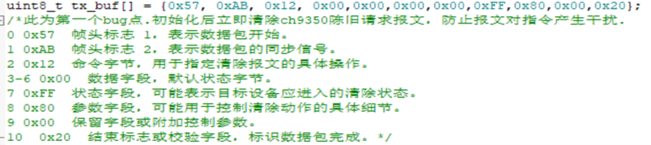

# stm32-Mouse-to-Joystick

**This is a coursework of BJTU CNSCC.131: Digital Systems [1]**

**1.Function**

The project designs a hardware which converts mouse signals into PS4 game controller signal.  To be more specific, it consists of three main components: 1. Using a CH9350 chip to convert USB protocol mouse signals into serial signals. 2. Map Mouse Speed to Joystick Movement. 3. Modify HID Descriptors to Output PS4 Joystick Signals

**2.Background (What’s the project used for)**

A large portion of games are exclusive to consoles (such as Sony PlayStation), and these platforms can only be played with controllers, not with a keyboard and mouse. Furthermore, console platforms are usually closed source, making it impossible to simulate a mouse as a virtual controller through software. Therefore, it is necessary to develop a hardware peripheral that converts the mouse into a controller, to assist players who are not accustomed to using controllers.

**3.Instructions** 

I will show how I develop this project in this section.

**3.1 Apparatus**

Hardware: stm32f103c8t6, CH9350(USB keyboard and mouse to serial communication control chip)

Software: STM32CubeMX, Keil5.

**3.2Designing Procedure**

The designing procedure mainly includes four parts, creating a suitable STM32CubeMx project, modifying HID Descriptors, adjusting settings to receive data from mouse and mapping.

**3.2.1 Generate the Project Using STM32CubeMX**

Completing all hardware connections, use STM32 STM32CubeMX to generate an HID USB\_DEVICE project. Pay special attention to manually adjust the clock settings as shown in the figure.

settings

Clock Tree

**3.2.2 Modify HID Descriptors**

The purpose of this step is to ensure that the STM32 microcontroller is correctly recognized as a PS4 controller. We need to obtain the low-level information about the PS4 hardware, which can be found at https://psdevwiki.com/ps4/DS4-USB. First, write the HID Descriptor information provided on the webpage into the `usbd\_custom\_hid\_if.c` file of the project (replacing the default description). Then, write the Data Format from the webpage into `usbd\_custom\_hid\_device.c`. After completing this, a firmware flash should result in the microcontroller being recognized as a PS4 

Part of HID Descriptor in usbd\_custom\_hid\_if.c

Part of Data Format in usbd\_custom\_hid\_device.c

**3.2.3 Receive Mouse Signals**

This is the most complex part of the project. Initially, we need to send an empty packet to the CH9350 to prevent interference caused by any stale packets. Since the mouse sends discrete data, we need to set up a UART idle interrupt to handle each incoming data packet. The specific interrupt logic is written in the `stm32xx\_it.c` file. This project uses DMA to receive mouse data, and we need to manually disable the half-full interrupt (DMA\_IT\_HT) in the USART, otherwise, severe lag may occur. (The likely cause is that the half-full interrupt is only suitable for double-buffered storage).

Sending empty packet to the CH9350 in main.c

Interrupt logic in stm32xx\_it.c

Disabling the half-full interrupt in usart.c

**3.2.4 Mapping**

After receiving the mouse data, we need to analyze the mouse movement speed and map it to joystick displacement (implemented in `main.c`). Since most common mice are relative mice, the position data they send represents displacement relative to the previous frame, which is essentially the speed. Therefore, there is no need to divide by time. However, we must ensure that the mapped joystick displacement stays within the range of -127 to 127 to avoid overflow. When the mouse is stationary, the joystick displacement should be set to 0. Additionally, the left and right mouse buttons are mapped to the left and right triggers of the controller.

Mapping in main.c

**4. Testing Results**

After flashing the firmware, the device can be tested on a gamepad testing website (https://hardwaretester.com/gamepad), and it achieves the expected results. I also conducted practical game tests. The device works well with most single-player games, including Sekiro: Shadows Die Twice, The Witcher 3, and Persona 5. However, multiplayer games such as APEX Legends do not recognize the controller. This issue may be related to anti-cheat mechanisms, as the `gamepad\_id` is missing in the HID descriptor, which contains the controller's motherboard information. I was unable to find any related open-source information. Additionally, because the joystick should be centered when the mouse is stationary, this causes the joystick to incorrectly center during the UART interrupt time between two signals, leading to the joystick frequently jumping back to the origin position. I have not yet solved this imperfection.

**5. Evaluation**

This is the first open-source project that converts a keyboard and mouse into a game controller based on hardware. Although there are similar converters on the market, their prices are usually quite high, ranging from 200 to 2,000 RMB. In contrast, the material cost of this project is approximately 30 RMB. Future development could focus on creating companion software to adjust sensitivity, and incorporating a Bluetooth wireless flashing module for real-time updates, allowing users to customize settings according to their preferences.
